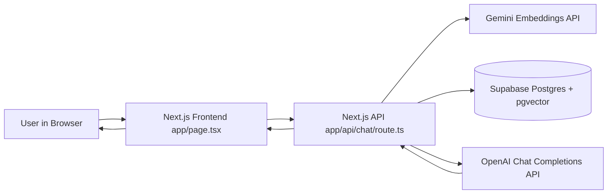

# Resume RAG Chatbot

## System Architecture

This project is a full-screen Next.js chat application with streaming responses, retrieval-augmented generation (RAG), and Supabase Postgres vector search.



## Runtime Flow

1. User sends a message in `app/page.tsx` (`onSubmit`).
2. Frontend calls `POST /api/chat` and opens a streaming reader.
3. API route embeds the question (`embedText`).
4. API route queries top relevant chunks from `rag_embeddings` (`retrieveTopChunks`).
5. API route builds prompt context from retrieved chunks.
6. API route calls chat completion with streaming and forwards token deltas to frontend.
7. Frontend appends streamed tokens into a single assistant bubble in real time.

## Integration Functions

- `app/page.tsx:onSubmit`  
  Connects frontend input to backend `/api/chat` and streams output into the UI.

- `app/api/chat/route.ts:POST`  
  Orchestrates end-to-end RAG: validate input, retrieve context, call LLM, stream response.

- `app/api/chat/route.ts:embedText`  
  Connects backend to Gemini embeddings endpoint.

- `app/api/chat/route.ts:retrieveTopChunks`  
  Connects backend to Supabase Postgres vector similarity search.

- `app/api/chat/route.ts:ensureRagTableAndSeed`  
  Connects local embedding file bootstrap to DB table setup and initial data load.

## Database Schema

Primary table: `rag_embeddings`

- `id` `TEXT PRIMARY KEY`
- `section` `TEXT NOT NULL`
- `chunk_text` `TEXT NOT NULL`
- `embedding` `VECTOR(3072) NOT NULL`

Schema SQL is in `sql/rag_embeddings.sql`.

## How To Update Resume Data

1. Update source chunks in `data/resumeChunks.json`.
2. Regenerate embeddings:
   - `node --env-file=.env.local scripts/generateEmbeddings.mjs`
3. Upsert into Supabase and verify retrieval:
   - `node --env-file=.env.local scripts/ragPostgres.mjs "test question"`
4. Restart app if needed and test in UI.

## How To Add New Functionality

1. Backend features:
   - Extend `app/api/chat/route.ts` after retrieval and before chat call.
2. Retrieval behavior:
   - Adjust `retrieveTopChunks` query or add metadata filters.
3. New data domains:
   - Add new chunks to JSON, regenerate embeddings, upsert to DB.
4. UI behavior:
   - Update `app/page.tsx` for message rendering, streaming UX, and input controls.

## Environment Variables

- `DATABASE_URL`
- `GEMINI_API_KEY`
- `OPENAI_API_KEY`
- `EMBEDDINGS_BASE_URL`
- `OPENAI_BASE_URL`
- `EMBEDDING_MODEL`
- `CHAT_MODEL`
- `EMBEDDING_DIM`
- `RESUME_CHUNKS_PATH`
- `RESUME_EMBEDDINGS_PATH`


Mind map:

Perfect moment to **lock understanding**.
Below is a **clean mind-map (textual)** and a **simple step summary** you can reuse for LinkedIn, interviews, or explaining to anyone.

---

## 🧠 Mind Map — Resume AI Assistant Project (Below is only for understanding above one is correct implemenation)

```
AI Resume Assistant
│
├── UI (Next.js)
│   ├── Full-screen chat (desktop + mobile)
│   ├── Streaming responses
│   └── Auto-scroll + typing indicator
│
├── Knowledge Preparation
│   ├── Resume → clean text
│   ├── Manually structured sections
│   └── RAG-ready chunks (meaningful)
│
├── Embeddings
│   ├── Convert chunks → vectors
│   └── Store embeddings
│
├── Retrieval (RAG core)
│   ├── User question → embedding
│   ├── Similarity search
│   └── Top relevant chunks
│
├── Chat Generation
│   ├── Context + question
│   └── LLM generates grounded answer
│
├── Database
│   ├── Supabase Postgres
│   └── Persistent embeddings for Vercel
│
└── Deployment
    ├── Vercel
    ├── Env variables
    └── Public LinkedIn demo
```

---

## 📌 Clean Step-by-Step Summary (What & Why)

### Step 1: UI (Next.js)

**What:** Built a full-screen chatbot UI with streaming responses.
**Why:** First impressions matter; UX sells the project.

---

### Step 2: Resume Preparation (Manual)

**What:** Converted resume into clean, structured chunks by section.
**Why:** RAG works on meaning, not PDFs. Manual structuring improves accuracy.

---

### Step 3: Embeddings

**What:** Generated embeddings for each resume chunk.
**Why:** Embeddings turn text into searchable knowledge.

---

### Step 4: Retrieval (RAG)

**What:** Matched user questions with the most relevant resume chunks using similarity search.
**Why:** This grounds answers in your actual experience.

---

### Step 5: Chat Generation

**What:** Passed retrieved chunks + user question to the LLM.
**Why:** The model answers only from your resume, not guesses.

---

### Step 6: Database (Supabase Postgres)

**What:** Stored embeddings in Postgres using pgvector.
**Why:** Vercel is stateless; DB gives persistence and production credibility.

---

### Step 7: Streaming + UX Polish

**What:** Streamed responses token-by-token and auto-scrolled chat.
**Why:** Makes the assistant feel alive and professional.

---

### Step 8: Deployment (Vercel)

**What:** Deployed with env vars for DB and OpenAI.
**Why:** Public, shareable, reliable demo for LinkedIn.

---

## 🧠 One-Line Project Explanation (High Signal)

> Built a full-stack AI resume assistant using Next.js and RAG, where resume data is pre-processed, embedded, retrieved via similarity search, and streamed to users through a real-time chat interface.


